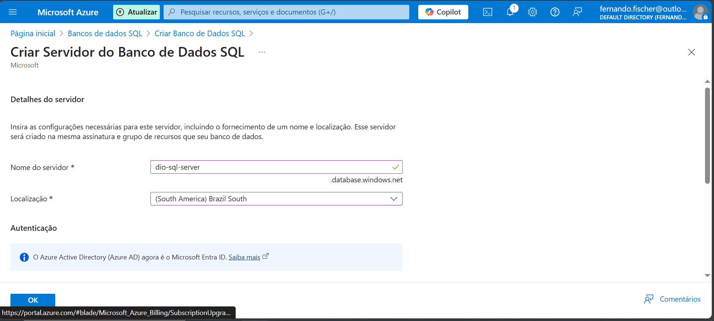
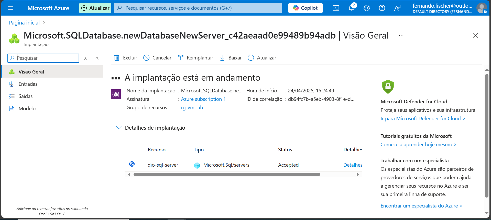
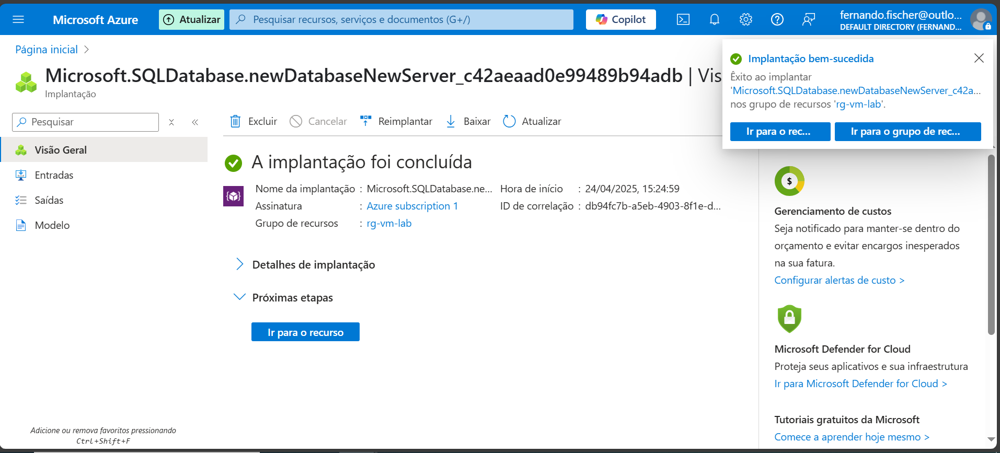
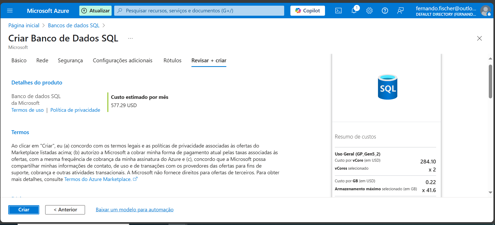
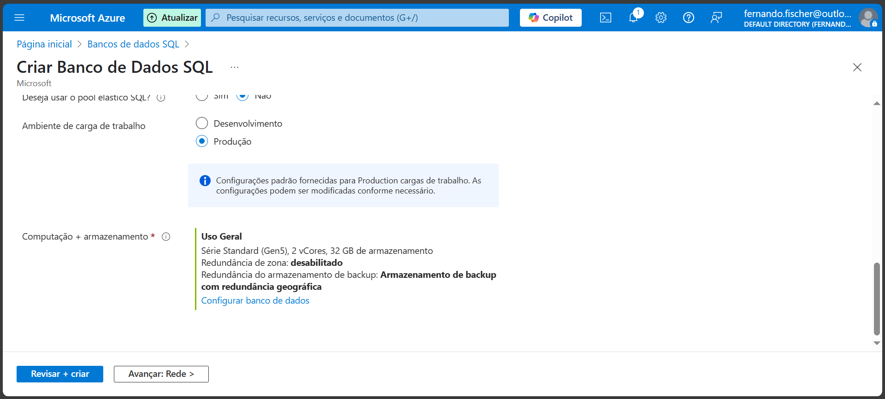
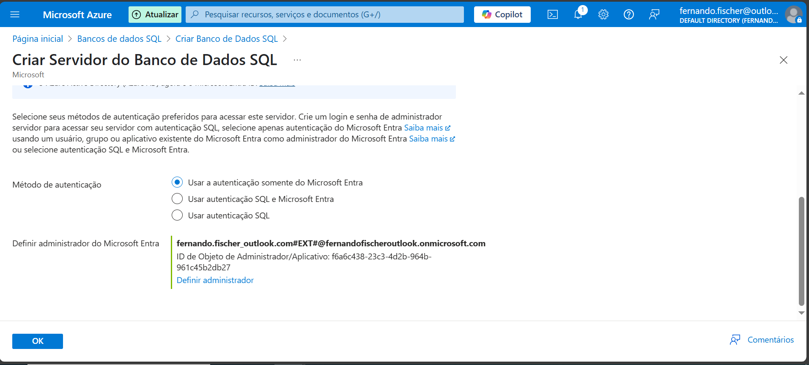
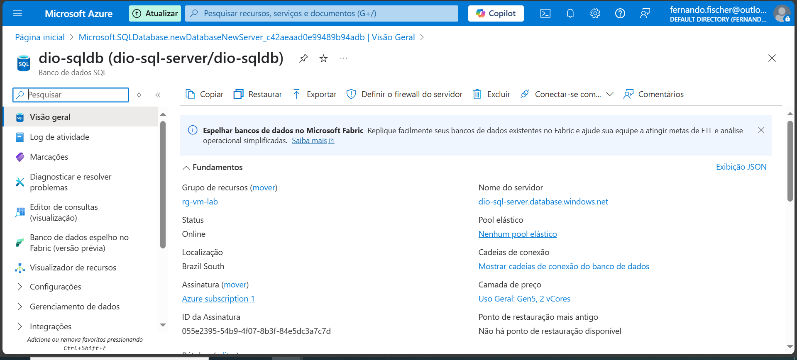

# 💾 Azure SQL Lab

Este repositório documenta o processo de criação e configuração de uma instância de Banco de Dados SQL no Microsoft Azure, como parte do desafio prático da DIO.

## 📌 Objetivo

Praticar a criação de uma instância de banco de dados na nuvem com o Azure SQL Database, entendendo todas as etapas do provisionamento e conectividade.

## 🛠️ Etapas realizadas

### 1. Criar servidor de banco de dados no Azure

### 2. Configuração do banco de dados

### 3. Autenticação e regras de firewall

### 4. Detalhes do produto selecionado

### 5. Implantação da instância
  

### 6. Detalhes finais do servidor SQL criado

## 📚 Aprendizados

- Criação de SQL Server gerenciado no Azure
- Configuração de autenticação
- Permissões de acesso com firewall
- Entendimento da camada de preços e escalabilidade

## ✅ Conclusão

Desafio prático concluído com sucesso. A documentação e as imagens servem como material de apoio para futuras implementações em ambientes de produção ou testes.
